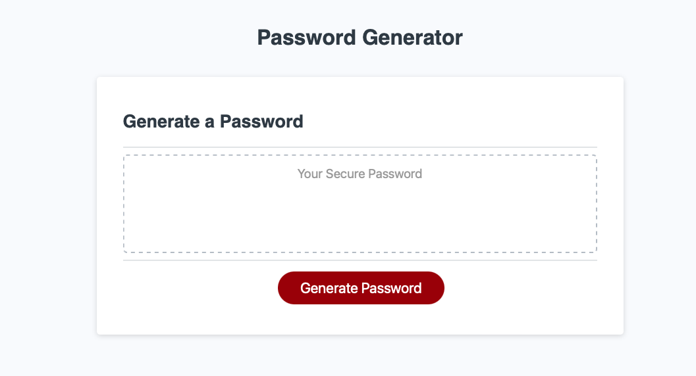

# Secure Password Generator

Welcome to the Secure Password Generator website! This application helps you to generate secure passwords! Try it!

## Features

- **Password Length:** Choose the length of your password within the range of 8 to 128 characters.
- **Character Sets:** Passwords include a mix of uppercase letters, lowercase letters, numbers, and special characters.
- **Random Generation:** Utilizes a randomization algorithm to ensure unpredictability.
- **User-Friendly Interface:** Simple and intuitive design for easy password generation.

## Getting Started

1. Open the [Secure Password Generator Website](https://lage356.github.io/securePasswordGen/).
2. Specify the desired length of your password (between 8 and 128 characters).3. Specify if you want special characters
4. Specify if you want uppercase characters
5. Specify if you want lowercase characters6. Specify if you want numbers
3. Click the "Generate Password" button.
4. Your secure password will be displayed on the screen.

## Example

## Security

- The generated passwords are designed to be strong and secure.
- Ensure that you store your passwords in a safe and confidential manner.
- Avoid sharing your passwords with others.

## Technologies Used

- HTML
- CSS
- JavaScript (Randomization Algorithm)

## Contributing

N/A

## License

This project is licensed under the [MIT License](LICENSE).

## Contact

If you have any questions, feedback, or issues, please reach out to us:

- Email: fernando.lage356@gmail.com
- GitHub: https://github.com/lage356

Thank you for using the Secure Password Generator! Stay secure online.
